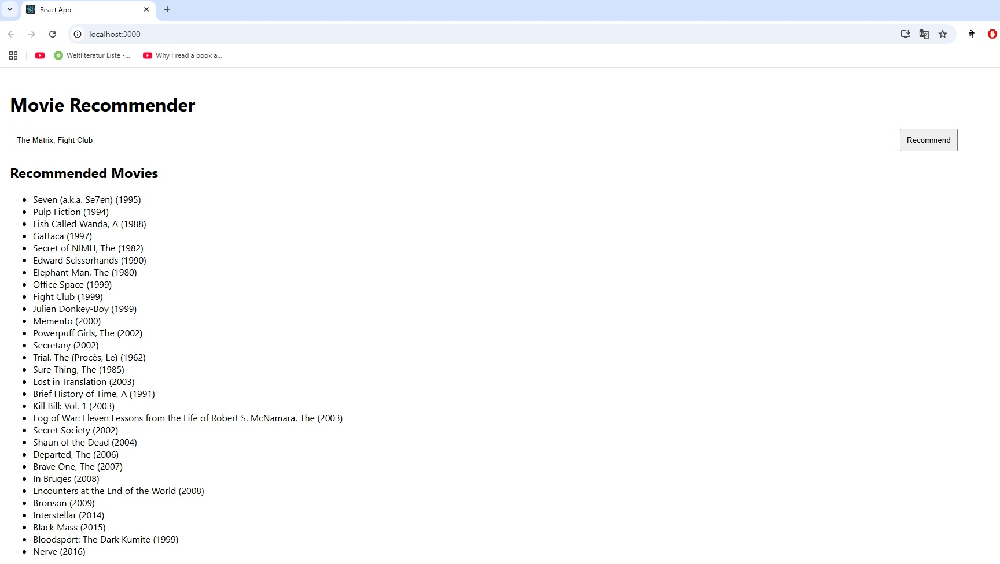

# recommendation-system
# Movie Recommender System

A simple end-to-end movie recommender built with:

- PyTorch Matrix Factorization
- FastAPI backend for inference
- React frontend for interaction

## 📂 Repo Structure

- `data/`: Raw and processed datasets
- `train/`: Training scripts
- `app/backend/`: FastAPI backend + saved models
- `app/frontend/`: ReactJS frontend
## Preview
Here is a little preview of how the app looks like:

## Data
This project uses [MovieLens] (https://grouplens.org/datasets/movielens/) dataset. Please read the license agreements.

For this project, we used the *ml-latest-small.zip*
You can train it according to the notebook to obtain the weights.

## Training & Saving the model

1. Download the dataset.
2. Train the model from according to the notebook.
3. Save the model weights into backend/assets/. The structure should look like this
```
app\backend\assets
├── __init__.py
├── kmeans_model.pkl    
├── mappings.pkl        
├── movie_embeddings.npy
└── movies.csv
```
4. You can then run the backend and the frontend code as described below.


## 🚀 Running Locally

### 1. Backend

```bash
cd app/backend
pip install -r ../../requirements.txt
uvicorn main:app --reload
```

### 1. Frontend

```bash
cd app/frontend
npm install
npm start
```

## 🙌 Acknowledgements

- Thanks to [@SpencerPao](https://github.com/SpencerPao/) for helpful ideas and code snippets.
- Check out his YT Channel for useful tutorials. [Link](https://www.youtube.com/@SpencerPaoHere)